# 📊 Diagram ERD (Entity Relationship Diagram) - MBG Lebak

Dokumen ini berisi visualisasi Diagram ERD untuk seluruh entitas database **Sistem Informasi Makan Bergizi Gratis (MBG) Kabupaten Lebak**.

---

```mermaid
erDiagram
    user ||--o{ session : "owns"
    user ||--o{ account : "has"
    kecamatan ||--o{ desa : "contains"
    kecamatan ||--o{ sekolah : "located_in"
    kecamatan ||--o{ posyandu : "located_in"
    kecamatan ||--o{ penggilingan : "located_in"
    desa ||--o{ sppg : "located_in"
    desa ||--o{ sekolah : "located_in"
    desa ||--o{ posyandu : "located_in"
    yayasan ||--o{ sppg : "manages"

    sppg ||--o{ sppg_sertifikasi : "holds"
    sppg ||--o{ sppg_penerima_manfaat : "distributes_to_school"
    sppg ||--o{ sppg_posyandu_manfaat : "distributes_to_posyandu"
    sekolah ||--o{ sppg_penerima_manfaat : "receives_from_sppg"
    posyandu ||--o{ sppg_posyandu_manfaat : "receives_from_sppg"

    kategori_penerima ||--o{ sekolah : "categorizes"
    kategori_penerima ||--o{ standar_menu_gizi : "targets"

    pemasok ||--o{ sppg_pembelian_bahan : "supplies"
    jenis_pangan ||--o{ sppg_pembelian_bahan : "purchased"
    jenis_pangan ||--o{ sppg_pemakaian_bahan : "consumed"
    jenis_pangan ||--o{ sppg_uji_rapid_test : "tested"
    master_parameter_uji ||--o{ sppg_uji_rapid_test : "defines_parameter"

    sppg ||--o{ sppg_pembelian_bahan : "purchases"
    sppg ||--o{ sppg_pemakaian_bahan : "uses_stock"
    sppg ||--o{ sppg_uji_rapid_test : "conducts_test"
    standar_menu_gizi ||--o{ sppg_pemakaian_bahan : "recipe_for"

    penggilingan ||--o{ penggilingan_sumber_gabah : "procures"
    penggilingan ||--o{ penggilingan_produksi : "processes"
    penggilingan ||--o{ penggilingan_distribusi : "dispatches"
    sppg ||--o{ penggilingan_distribusi : "receives_rice"

    sppg ||--o{ sppg_laporan_aktifitas : "submits"
    sekolah ||--o{ sppg_laporan_aktifitas : "targeted_in"
    posyandu ||--o{ sppg_laporan_aktifitas : "targeted_in"
    standar_menu_gizi ||--o{ sppg_laporan_aktifitas : "served_in"

    sppg_laporan_aktifitas ||--o{ sekolah_laporan_aktifitas : "verified_by_school"
    sppg_laporan_aktifitas ||--o{ posyandu_laporan_aktifitas : "verified_by_posyandu"

    sppg ||--o{ pengaduan : "reported_in"
    sekolah ||--o{ pengaduan : "reported_in"
    user ||--o{ pengumuman : "author_of"
    sppg ||--o{ pengumuman : "published_by"

    user {
        string id PK
        string name
        string email
        string role
        int sppg_id FK
    }

    sppg {
        int sppg_id PK
        string id_sppg_code
        string nama_sppg
        int desa_id FK
        string status_operasional
    }

    sekolah {
        int sekolah_id PK
        string nama_sekolah
        string npsn
        int kategori_id FK
        int jumlah_siswa_total
    }

    posyandu {
        int id PK
        string nama_posyandu
        int jumlah_busui
        int jumlah_balita
        int jumlah_bumil
        int jumlah_total
    }

    master_parameter_uji {
        int id PK
        string nama_parameter
        string kategori
        string ambang_batas
        boolean status_aktif
    }

    sppg_uji_rapid_test {
        int id PK
        int sppg_id FK
        int jenis_pangan_id FK
        int parameter_uji_id FK
        string hasil_uji
        string petugas_penguji
    }

    sppg_laporan_aktifitas {
        int id PK
        int sppg_id FK
        int sekolah_id FK
        int posyandu_id FK
        date tanggal
        int standar_menu_id FK
        int jumlah_porsi
        string status
    }

    sekolah_laporan_aktifitas {
        int id PK
        int sppg_laporan_id FK
        int sekolah_id FK
        timestamp tanggal_diterima
        string status_diterima
        string kondisi_makanan
    }

    posyandu_laporan_aktifitas {
        int id PK
        int sppg_laporan_id FK
        int posyandu_id FK
        timestamp tanggal_diterima
        string status_diterima
        string kondisi_makanan
    }
```

