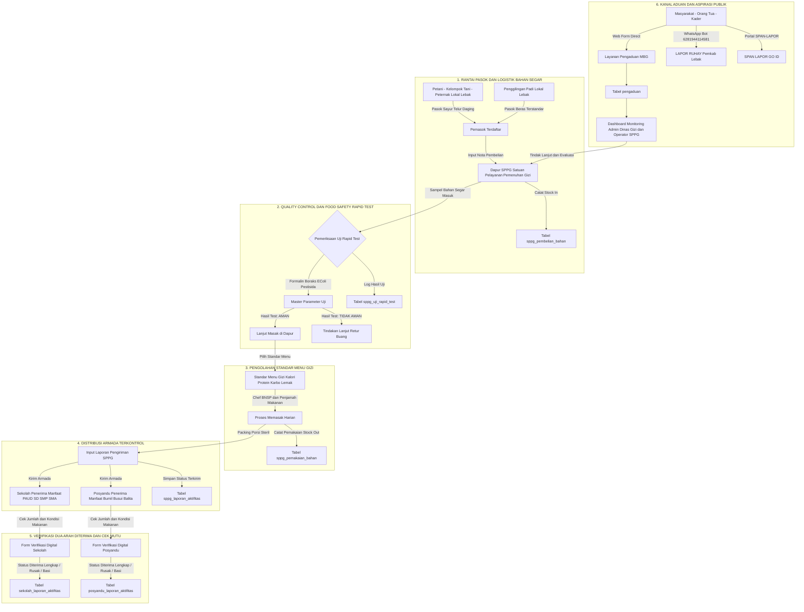

# 📋 PRD (Product Requirements Document) & Alur Ekosistem System - MBG Lebak

Dokumen ini berisi spesifikasi kebutuhan produk (*Product Requirements Document*) dan alur kerja (*Workflow Architecture Diagram*) untuk **Sistem Informasi Makan Bergizi Gratis (MBG) Kabupaten Lebak**.

---

## 🔄 Diagram Alur Ekosistem MBG (End-to-End Workflow)

---

## 👥 Peran Pengguna (User Roles & Permissions)

1. **`admin_dinas` / `super_admin`**:
   - Mengelola master data wilayah, sekolah, posyandu, yayasan, SPPG, dan master parameter uji.
   - memantau dashboard pengawasan hulu ke hilir secara realtime.
   - Menindaklanjuti laporan pengaduan publik.
2. **`operator_sppg`**:
   - Menginput data pembelian bahan segar dan pemakaian harian.
   - Menginput log hasil uji rapid test laboratorium dapur.
   - Membuat laporan pengiriman porsi harian ke Sekolah dan Posyandu.
3. **`operator_sekolah`**:
   - Memverifikasi penerimaan paket makanan harian dari SPPG (konfirmasi porsi dan kondisi makanan).
4. **`operator_posyandu`**:
   - Memverifikasi penerimaan PMT / paket makanan harian untuk Ibu Hamil, Ibu Menyusui, dan Balita.
5. **`operator_penggilingan`**:
   - Menginput sumber gabah, produksi beras, dan realisasi pengiriman beras ke Dapur SPPG.
6. **`publik`**:
   - Mengakses direktori transparansi data SPPG, Sekolah, Posyandu, Penggilingan.
   - Mengirimkan pengaduan / masukan publik secara langsung.
