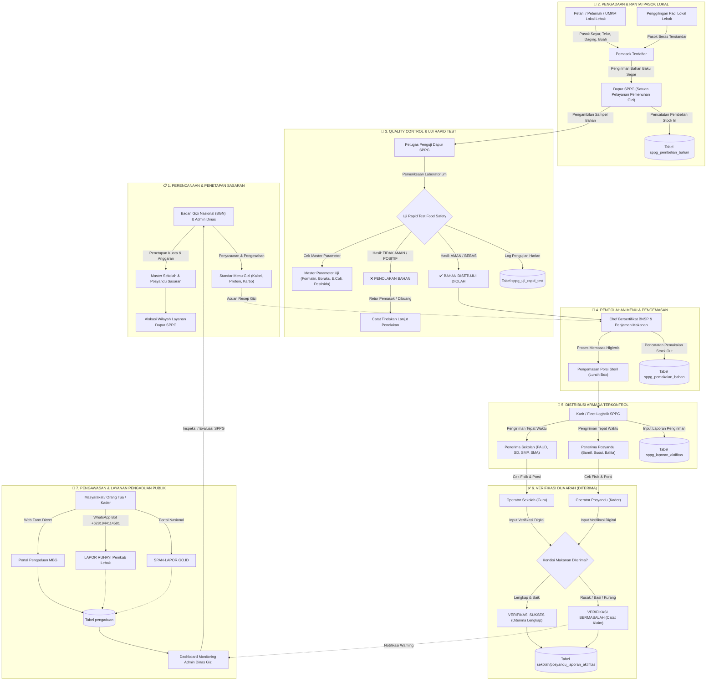

# 📊 Flowchart Proses Bisnis - MBG Kabupaten Lebak

Dokumen ini berisi alur proses bisnis (*Business Process Flowchart*) end-to-end untuk **Sistem Informasi Makan Bergizi Gratis (MBG) Kabupaten Lebak**, mulai dari perencanaan sasaran, rantai pasok bahan segar, pengawasan mutu food safety, produksi dapur, pengiriman, verifikasi penerimaan dua arah, hingga penanganan aduan publik.

---

## 🔄 Diagram Flowchart Proses Bisnis (Mermaid)

---

## 📝 Penjelasan Tahapan Proses Bisnis

### 1. Perencanaan & Penetapan Sasaran
- Badan Gizi Nasional (BGN) bersama Pemkab Lebak menetapkan kuota penerima dan alokasi anggaran.
- Menetapkan daftar master sekolah (PAUD s/d SMA) dan posyandu (Ibu Hamil, Ibu Menyusui, Balita).
- Mengesahkan **Standar Menu Gizi Seimbang** (target kalori, protein, karbohidrat, dan lemak).

### 2. Rantai Pasok & Pengadaan Bahan Lokal
- Petani, peternak, UMKM, dan penggilingan padi lokal Lebak terdaftar memasok bahan segar ke Dapur SPPG.
- Operator SPPG menginput data transaksi pembelian bahan baku ke tabel `sppg_pembelian_bahan` (Stock In).

### 3. Quality Control (Rapid Test Food Safety)
- Petugas Laboratorium Dapur melakukan uji rapid test terhadap cemaran **Formalin, Boraks, E. Coli, Salmonella, dan Residu Pestisida** mengacu pada `master_parameter_uji`.
- **Hasil Positif (Tidak Aman)** ➔ Bahan ditolak, diretur/dibuang, dan dicatat tindakan lanjutnya.
- **Hasil Negatif (Aman)** ➔ Bahan disetujui untuk dimasak.

### 4. Pengolahan & Pengemasan Makanan
- Chef bersertifikat BNSP memasok dan mengolah makanan sesuai standar resep gizi.
- Menginput pemakaian bahan baku ke tabel `sppg_pemakaian_bahan` (Stock Out).
- Makanan dikemas dalam porsi steril bermutu tinggi.

### 5. Distribusi Armada Terkontrol
- Kurir armada SPPG mengantar porsi makanan harian tepat waktu sebelum jam makan siang/pemberian PMT.
- SPPG mengunggah foto dokumentasi pengiriman dan laporan porsi di tabel `sppg_laporan_aktifitas`.

### 6. Verifikasi Dua Arah (Two-Way Digital Receipt)
- Operator Sekolah (Guru) dan Operator Posyandu (Kader) menerima paket makanan di lokasi.
- Mengisi konfirmasi digital (`sekolah_laporan_aktifitas` & `posyandu_laporan_aktifitas`) mengenai porsi dan kondisi makanan (*Baik*, *Rusak*, *Basi*, atau *Kurang*).

### 7. Monitoring & Layanan Pengaduan Publik
- Masyarakat dan penerima manfaat dapat mengirim aduan via **Web Form Direct**, **LAPOR RUHAY WhatsApp (+6281944114581)**, atau **SPAN-LAPOR.go.id**.
- Admin Dinas Gizi dan Supervisor memantau dashboard aduan secara real-time untuk penindakan dan evaluasi operasional dapur SPPG.
